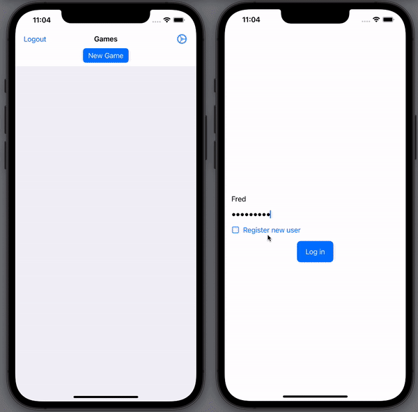

# Realm-Sweeper iOS App
This is the iOS app for Realm-Sweeper.



## Configure and Run
- Create the [backend Realm App](../Realm)
- Open `RealmSweeperApp.xcodeproj` in Xcode
- Copy the Realm App ID from your Realm-Sweeper backend Realm app, and paste it into `RealmSweeper.swift`:

```swift
let realmApp = RealmSwift.App(id: "realmsweeper-xxxxx")
```
- Select your target in Xcode
- Build and run with `⌘R`

## Technology Stack
This app uses SwiftUI & Realm.

Each game is a Realm Object. As you click on a cell, Realm Sync copies changes to any other devices that are playing the same game

## Using the App

You can register new users within the app.

If multiple people (devices) want to collaborate on the same game then they should log in with the same username/password.
